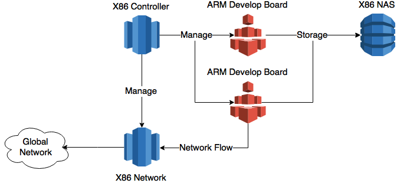

# DozenCloud 伊達雲

## Intro

### 起源
目前市面上並沒有太盛行 ARM VPS 相關的服務，唯法國公司 Scaleway 提供 Bare-Metal ARM Module Server 給一般人租用。但是因為台灣地理位置距離法國太遠，網路延遲相當嚴重，所以開啟 DozenCloud 計畫，希望能在台灣建立原生 ARM 雲端環境，供 ARM 開發者可以方便開發與測試。更進一步因為 ARM 的低功耗、低成本優勢，更可在 DozenCloud 上架設平衡附載伺服器、資料庫中心。

### 使用
* Openstack
* Docker

### 架構

使用 X86 電腦作為 Openstack Controller ，以及 Docker Container 的儲存空間，使用 ARM 開發板作為 Openstack 計算節點，可以享受到 Openstack 在 X86 上的強大支援，亦可提供原生的 ARM 開發環境。
